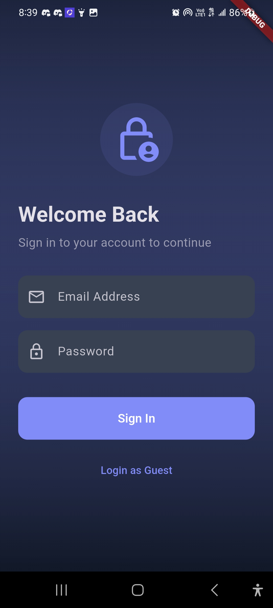
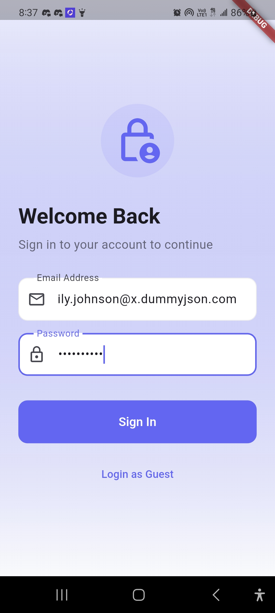
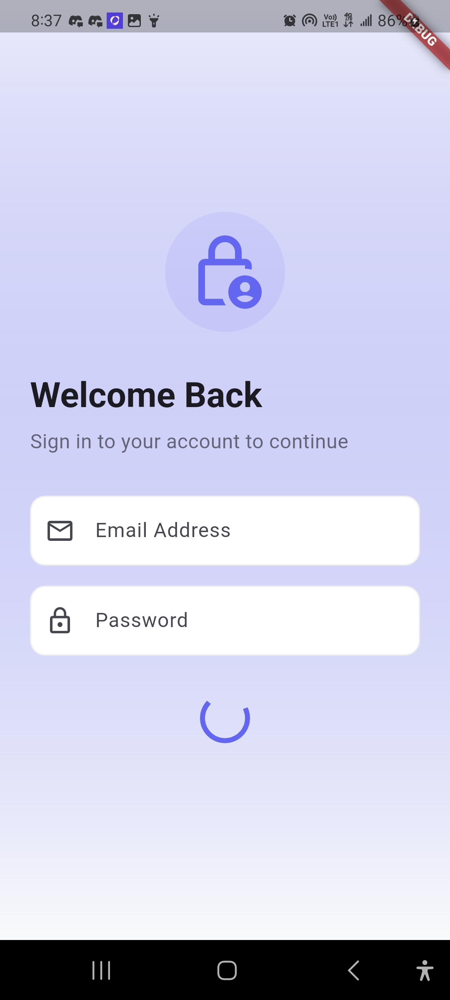
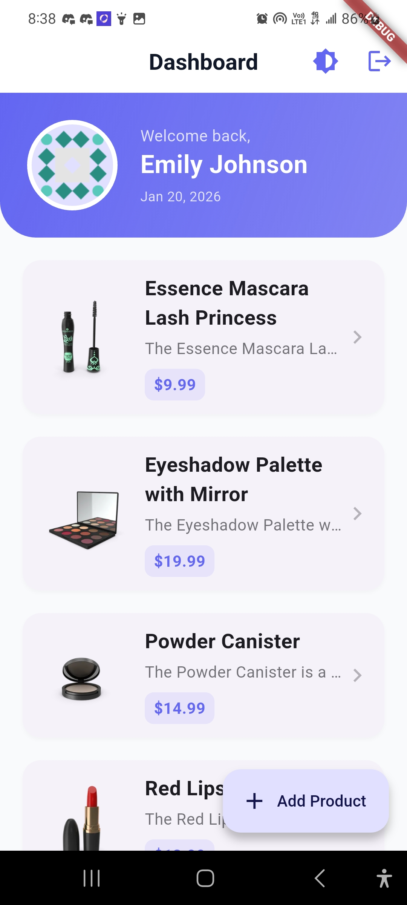
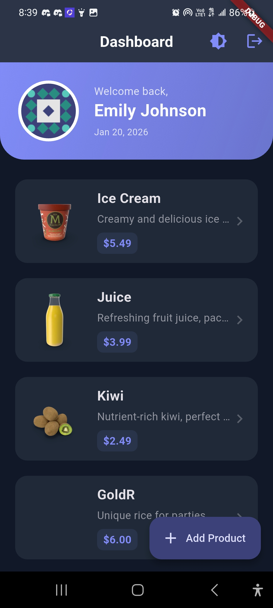
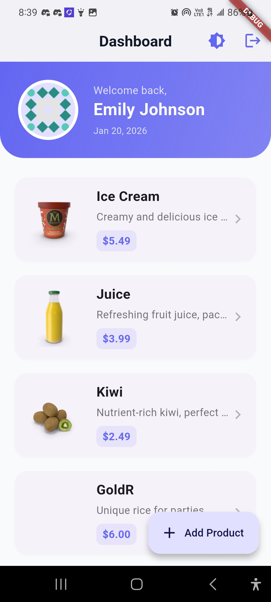
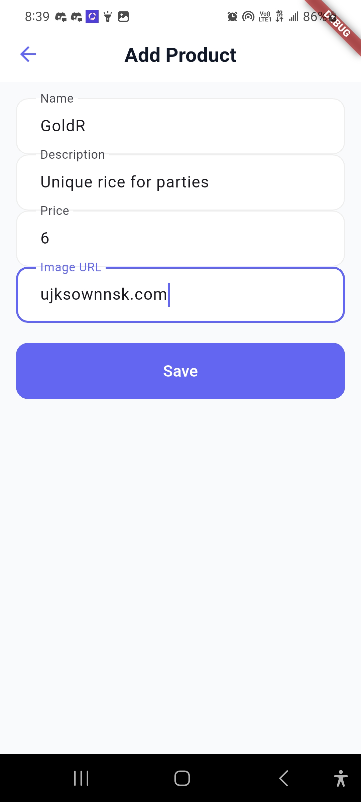

# CDLP App - Resilient Flutter Dashboard

A production-grade, API-driven Flutter application demonstrating mid-level engineering proficiency through secure authentication, efficient data fetching, and a scalable Clean Architecture.

## 📱 App Overview

CDLP App is a robust dashboard designed for authenticated access to product catalogs. It features:
- **Secure Authentication**: Email-based login with real-time mapping to API usernames.
- **Guest Access**: Quick entry via a guest login feature.
- **Dynamic Dashboard**: Responsive product list with asynchronous data fetching.
- **CRUD Operations**: Ability to add and update products with optimistic UI updates.
- **Security First**: Sensitive configurations handled via environment variables and secure storage.

## 🛠️ Setup Instructions

To run this project locally, follow these steps:

1. **Clone the Repository**:
   ```bash
   git clone https://github.com/GodswillErondu/cdlp_app.git
   cd cdlp_app
   ```

2. **Setup Environment Variables**:
   Create a `.env` file in the root directory and add the base URL:
   ```env
   BASE_URL=https://dummyjson.com
   ```
   *(Refer to `.env.example` for the template)*

3. **Install Dependencies**:
   ```bash
   flutter pub get
   ```

4. **Run the Application**:
   ```bash
   flutter run
   ```

## � Test Credentials

You can use the following credentials to test the authentication (mapped from DummyJSON usernames):

| Field | Value |
| --- | --- |
| **Email** | `emily.johnson@x.dummyjson.com` |
| **Password** | `emilyspass` |

*Alternatively, use the **Login as Guest** button for quick access.*

## 📱 App Screenshots

### 🔐 Login Screens




---

### 📊 Dashboard




---

### ➕ Add Product


## 🧠 State Management Approach

This project utilizes **Flutter Riverpod** for state management, following the **AsyncNotifier** pattern.

- **Why Riverpod?**: It provides a compile-safe, testable, and robust way to manage asynchronous state (Loading → Data → Error).
- **Architecture**:
  - `productListProvider`: Manages the state of the product catalog.
  - `authNotifierProvider`: Handles the authentication lifecycle and user session.
  - Providers are decoupled from the UI, ensuring high maintainability and testability.

## 🏗️ Architecture Stack

- **Framework**: Flutter
- **Language**: Dart (Full Null-Safety)
- **Networking**: Dio (with Interceptors for token management)
- **Persistence**: `flutter_secure_storage` for sensitive tokens.
- **UI Design**: Vanilla CSS-inspired styling with modern HSL palettes and glassmorphism.


